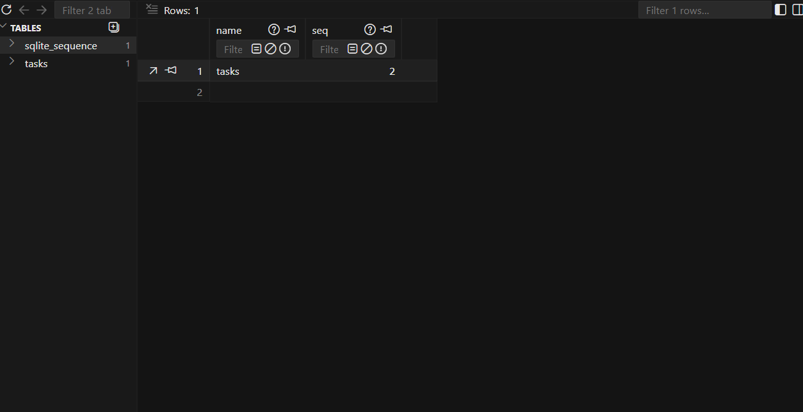

# Task CRUD API

A simple CRUD API for managing tasks, built with Express.js with SQLite database storage and documented with Swagger/OpenAPI.

## Why SQLite?

SQLite was chosen for this project because:
- **Zero Configuration**: No database server setup required - works out of the box
- **Portable**: Single database file that can be easily backed up or moved
- **Lightweight**: Perfect for small to medium applications
- **Built-in Node.js Support**: Works seamlessly with `better-sqlite3` package
- **SQL Support**: Full SQL capabilities for complex queries when needed
- **No Network Overhead**: Faster than client-server databases for local applications

## Database Storage

The database file is stored as `tasks.db` in the project root directory. The database is automatically created on first run with the following schema:

```sql
CREATE TABLE IF NOT EXISTS tasks (
  id INTEGER PRIMARY KEY AUTOINCREMENT,
  title TEXT NOT NULL,
  description TEXT,
  done BOOLEAN DEFAULT 0
)
```

## Installation & Running

```bash
npm install
npm start
```

The server will start on `http://localhost:4000` and automatically create the SQLite database if it doesn't exist.

## API Endpoints

| Method | Endpoint | Description |
|--------|-----------|-------------|
| GET | `/api/tasks` | Get all tasks (supports pagination via `currentCount` query param) |
| GET | `/api/tasks/:id` | Get a specific task by ID |
| POST | `/api/tasks` | Create a new task |
| PUT | `/api/tasks/:id` | Update an existing task |
| DELETE | `/api/tasks/:id` | Delete a task |
| GET | `/` | API information |
| GET | `/health` | Health check endpoint |
| GET | `/api-docs` | Swagger UI documentation |

### Pagination

The API uses a "load more" pattern. To load more tasks:
- First load: `GET /api/tasks?currentCount=0` → returns first 5 tasks
- Second load: `GET /api/tasks?currentCount=5` → returns first 10 tasks
- Third load: `GET /api/tasks?currentCount=10` → returns first 15 tasks

## Example Response

```bash
curl -i http://localhost:4000/api/tasks
```

```http
HTTP/1.1 200 OK
Content-Type: application/json

[
  {
    "id": 1,
    "title": "Buy groceries",
    "done": false
  },
  {
    "id": 2,
    "title": "Walk the dog",
    "done": true
  },
  {
    "id": 3,
    "title": "Read a book",
    "done": false
  }
]
```

## Swagger Documentation

Interactive API documentation is available at `http://localhost:4000/api-docs`


## Request/Response Examples

### Create a Task
```bash
curl -X POST http://localhost:4000/api/tasks \
  -H "Content-Type: application/json" \
  -d '{"title": "New task", "description": "Task description"}'
```

### Update a Task
```bash
curl -X PUT http://localhost:4000/api/tasks/1 \
  -H "Content-Type: application/json" \
  -d '{"title": "Updated task", "done": true}'
```

### Delete a Task
```bash
curl -X DELETE http://localhost:4000/api/tasks/1
```

## Project Structure

```
flyrank-crud-api/
├── controllers/
│   └── task.controller.js    # Task business logic
├── routes/
│   ├── index.route.js       # Main route aggregator
│   └── task.route.js        # Task endpoints with Swagger docs
├── services/
│   └── task.service.js      # Task data operations
├── database/
│   └── dbInit.js            # Database initialization and operations
├── server.js                # Express server setup
├── tasks.db                 # SQLite database file (auto-created)
├── openapi.json             # OpenAPI specification
├── package.json             # Project dependencies
└── README.md                # This file
```

## Technologies Used

- Node.js
- Express.js
- SQLite (via better-sqlite3)
- swagger-ui-express
- swagger-jsdoc

## Database Viewer

You can view the SQLite database using any SQLite browser tool. Here's an example using DB Browser for SQLite:



## Example SQL Query

Here's an example SQL query executed to get all completed tasks:

```sql
SELECT * FROM tasks WHERE done = 1;
```

Result:
```
id | title         | description | done
---|---------------|-------------|-----
2  | Walk the dog   |             | 1
5  | Buy groceries  |             | 1
```

## Database Operations

The project uses the following key SQL operations:

- **Create**: `INSERT INTO tasks (title, description) VALUES (?, ?)`
- **Read**: `SELECT * FROM tasks LIMIT ? OFFSET 0`
- **Update**: `UPDATE tasks SET title=?, done=? WHERE id=?`
- **Delete**: `DELETE FROM tasks WHERE id = ?`
