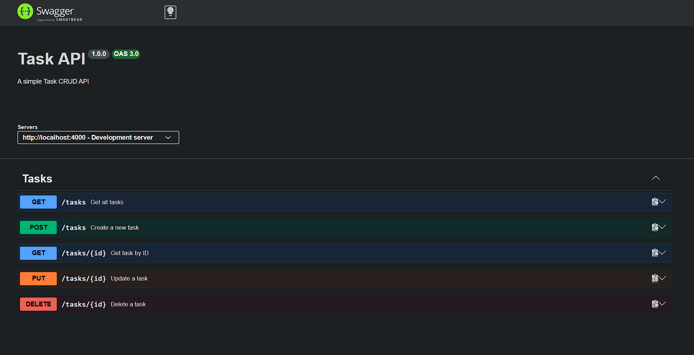

# Task CRUD API

A simple in-memory CRUD API for managing tasks, built with Express.js and documented with Swagger/OpenAPI.

## Features

- Create, read, update, and delete tasks
- In-memory data storage
- RESTful API design
- Interactive API documentation with Swagger UI
- ES modules support

## Installation & Running

```bash
npm start
```

The server will start on `http://localhost:4000`

## API Endpoints

| Method | Endpoint | Description |
|--------|-----------|-------------|
| GET | `/api/tasks` | Get all tasks |
| GET | `/api/tasks/:id` | Get a specific task by ID |
| POST | `/api/tasks` | Create a new task |
| PUT | `/api/tasks/:id` | Update an existing task |
| DELETE | `/api/tasks/:id` | Delete a task |
| GET | `/` | API information |
| GET | `/health` | Health check endpoint |
| GET | `/api-docs` | Swagger UI documentation |

## Example Response

```bash
curl -i http://localhost:4000/api/tasks
```

```http
HTTP/1.1 200 OK
Content-Type: application/json

[
  {
    "id": 1,
    "title": "Buy groceries",
    "done": false
  },
  {
    "id": 2,
    "title": "Walk the dog",
    "done": true
  },
  {
    "id": 3,
    "title": "Read a book",
    "done": false
  }
]
```

## Swagger Documentation

Interactive API documentation is available at `http://localhost:4000/api-docs`



## Request/Response Examples

### Create a Task
```bash
curl -X POST http://localhost:4000/api/tasks \
  -H "Content-Type: application/json" \
  -d '{"title": "New task", "description": "Task description"}'
```

### Update a Task
```bash
curl -X PUT http://localhost:4000/api/tasks/1 \
  -H "Content-Type: application/json" \
  -d '{"title": "Updated task", "done": true}'
```

### Delete a Task
```bash
curl -X DELETE http://localhost:4000/api/tasks/1
```

## Project Structure

```
flyrank-crud-api/
├── controllers/
│   └── task.controller.js    # Task business logic
├── routes/
│   ├── index.route.js       # Main route aggregator
│   └── task.route.js        # Task endpoints with Swagger docs
├── services/
│   └── task.service.js      # Task data operations
├── server.js                # Express server setup
├── task.js                  # Task data model
├── openapi.json             # OpenAPI specification
├── package.json             # Project dependencies
└── README.md                # This file
```

## Technologies Used

- Node.js
- Express.js
- swagger-ui-express
- swagger-jsdoc
